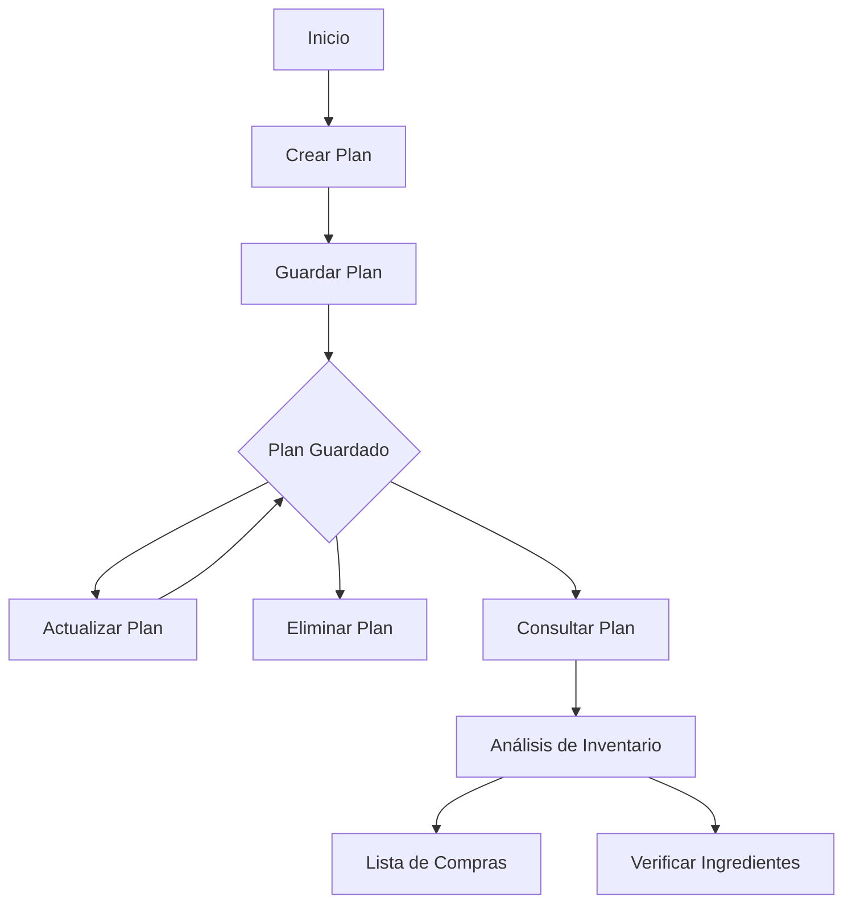

# Sistema de Planificación de Comidas - Documentación Detallada

## 1. Flujo de Planificación

### 1.1 Ciclo de Vida de un Plan de Comidas



### 1.2 Estados de un Plan
- **Upcoming**: Planes futuros
- **Active**: Plan del día actual
- **Completed**: Planes pasados
- **Deleted**: Planes eliminados

## 2. Componentes del Sistema

### 2.1 Plan de Comidas
- **Identificador único**: UUID para cada plan
- **Fecha**: Fecha específica del plan
- **Usuario**: ID del usuario propietario
- **Timestamp**: Fechas de creación y última modificación
- **Estado**: Estado actual del plan

### 2.2 Estructura de Comidas
```json
{
  "breakfast": {
    "recipes": [
      {
        "recipe_id": "string",
        "servings": "integer",
        "prep_time": "integer",
        "calories": "integer"
      }
    ],
    "notes": "string",
    "time_slot": "string"
  },
  "lunch": { },
  "dinner": { },
  "snacks": [ ]
}
```

### 2.3 Metadatos del Plan
```json
{
  "nutritional_info": {
    "total_calories": "integer",
    "protein": "float",
    "carbs": "float",
    "fats": "float",
    "fiber": "float"
  },
  "preparation": {
    "total_time": "integer",
    "difficulty_level": "string",
    "kitchen_requirements": ["string"]
  }
}
```

## 3. Funcionalidades Detalladas

### 3.1 Creación de Plan
1. **Selección de Fecha**
   - Validación de fecha no pasada
   - Verificación de plan existente
   - Bloqueo de fechas inválidas

2. **Selección de Recetas**
   - Búsqueda en catálogo
   - Filtros por:
     - Tiempo de preparación
     - Dificultad
     - Ingredientes disponibles
     - Calorías
     - Tipo de dieta

3. **Configuración de Porciones**
   - Ajuste por comida
   - Cálculo automático de cantidades
   - Actualización de valores nutricionales

### 3.2 Gestión de Inventario
1. **Verificación Automática**
   - Escaneo de inventario actual
   - Identificación de faltantes
   - Sugerencias de sustitución

2. **Lista de Compras**
   - Generación automática
   - Agrupación por categorías
   - Estimación de costos
   - Priorización de items

### 3.3 Análisis y Optimización
1. **Balance Nutricional**
   - Distribución de macronutrientes
   - Variedad de grupos alimenticios
   - Alertas de desbalances
   - Sugerencias de mejora

2. **Optimización de Tiempo**
   - Secuencia de preparación
   - Pasos en paralelo
   - Preparación anticipada
   - Reutilización de ingredientes

## 4. Integración con Otros Módulos

### 4.1 Sistema de Recetas
- Acceso al catálogo completo
- Filtros contextuales
- Sugerencias personalizadas
- Historial de uso

### 4.2 Gestión de Inventario
- Sincronización en tiempo real
- Reserva de ingredientes
- Alertas de stock bajo
- Predicción de necesidades

### 4.3 Análisis Nutricional
- Perfiles nutricionales
- Metas dietéticas
- Restricciones alimentarias
- Seguimiento de progreso

## 5. Endpoints Detallados

### 5.1 Crear/Actualizar Plan
```http
POST /planning/save
PUT /planning/update

Request:
{
  "date": "2024-01-20",
  "meals": {
    "breakfast": {
      "recipes": [
        {
          "recipe_id": "recipe_123",
          "servings": 2,
          "modifications": {
            "exclude": ["nueces"],
            "substitute": [
              {
                "original": "leche",
                "replacement": "leche de almendra"
              }
            ]
          }
        }
      ],
      "time_slot": "08:00",
      "notes": "Preparar la noche anterior"
    }
  },
  "preferences": {
    "prep_time_limit": 30,
    "calorie_target": 2000,
    "dietary_restrictions": ["vegetarian"]
  }
}
```

### 5.2 Consulta de Plan
```http
GET /planning/get?date=2024-01-20

Response:
{
  "plan": {
    "id": "plan_uuid",
    "date": "2024-01-20",
    "status": "upcoming",
    "meals": { },
    "metadata": {
      "created_at": "timestamp",
      "updated_at": "timestamp",
      "version": 1
    },
    "analysis": {
      "nutritional": { },
      "inventory": { },
      "preparation": { }
    }
  }
}
```

## 6. Casos de Uso Avanzados

### 6.1 Planificación Semanal
1. Creación de planes múltiples
2. Optimización de compras
3. Rotación de recetas
4. Balance semanal

### 6.2 Gestión de Eventos
1. Planes especiales
2. Ajuste de porciones
3. Consideraciones dietéticas
4. Preparación anticipada

### 6.3 Optimización de Recursos
1. Minimización de desperdicio
2. Reutilización de ingredientes
3. Optimización de costos
4. Eficiencia en preparación

## 7. Mejores Prácticas

### 7.1 Planificación
1. Revisar inventario antes de planificar
2. Considerar tiempo disponible
3. Balancear tipos de comidas
4. Incluir alternativas

### 7.2 Gestión
1. Actualizar planes con anticipación
2. Mantener inventario actualizado
3. Documentar modificaciones
4. Revisar análisis nutricional

### 7.3 Optimización
1. Aprender de históricos
2. Ajustar según feedback
3. Mantener variedad
4. Considerar estacionalidad

## 8. Manejo de Errores

### 8.1 Validaciones
- Fechas válidas
- Recetas existentes
- Porciones razonables
- Restricciones dietéticas

### 8.2 Conflictos
- Planes duplicados
- Ingredientes faltantes
- Restricciones de tiempo
- Límites nutricionales

### 8.3 Recuperación
- Versiones anteriores
- Planes alternativos
- Sustituciones automáticas
- Notificaciones de problemas

## 9. Métricas y Análisis

### 9.1 Uso del Sistema
- Planes creados/completados
- Recetas más usadas
- Patrones de modificación
- Tasas de cumplimiento

### 9.2 Eficiencia
- Tiempo de preparación
- Uso de ingredientes
- Costos promedio
- Desperdicios evitados

### 9.3 Satisfacción
- Planes completados
- Modificaciones necesarias
- Recetas repetidas
- Feedback de usuarios 