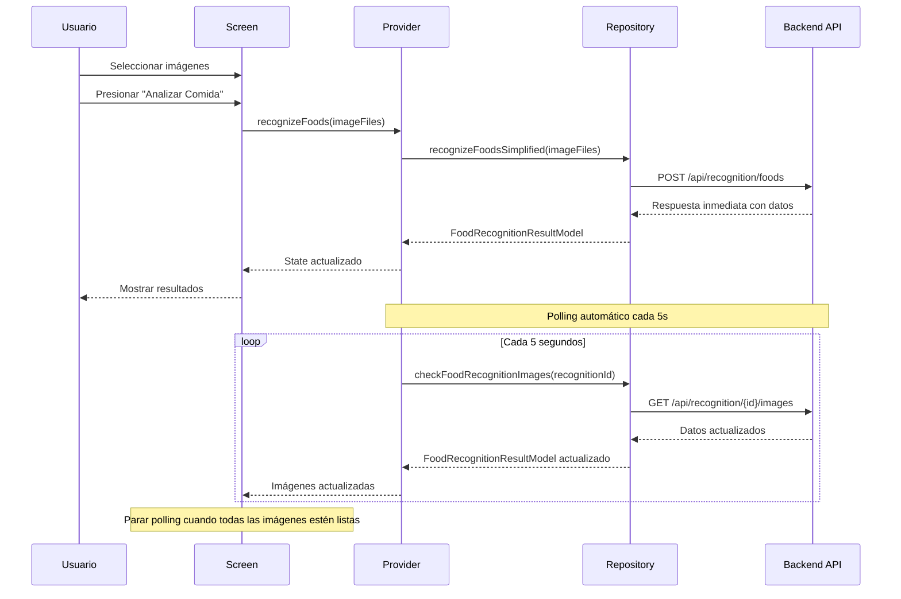

# 🍽️ Guía de Reconocimiento de Comidas - Flutter

## 📋 Resumen

Este documento describe la implementación completa del **sistema de reconocimiento de comidas simplificado** en Flutter, que funciona exactamente igual que el sistema de ingredientes pero está específicamente optimizado para detectar platos y comidas preparadas.

## 🏗️ Arquitectura del Sistema

### Backend (Ya implementado)
- **Endpoint**: `POST /api/recognition/foods`
- **Respuesta inmediata** con datos completos de reconocimiento
- **Generación automática de imágenes** en background
- **Polling automático** para actualizar imágenes cuando estén listas

### Frontend (Flutter)
- **Provider simplificado**: `SimplifiedFoodRecognitionProvider`
- **Screen dedicada**: `SimplifiedFoodRecognitionScreen`
- **Modelos de datos**: `FoodRecognitionResultModel`, `RecognizedFoodModel`
- **Repositorio extendido** con métodos para foods

## 🔧 Componentes Implementados

### 1. **API Service** (`lib/core/services/api_service.dart`)

```dart
/// ✨ Reconocimiento simplificado de comidas
Future<Map<String, dynamic>> recognizeFoodsSimplified(List<File> imageFiles);

/// ✨ Verificar estado de imágenes de comidas
Future<Map<String, dynamic>> checkFoodRecognitionImages(String recognitionId);
```

### 2. **Repository Interface** (`lib/features/recognition/domain/repositories/recognition_repository.dart`)

```dart
/// ✨ Reconocimiento simplificado de comidas con respuesta inmediata
Future<FoodRecognitionResultModel> recognizeFoodsSimplified(List<File> imageFiles);

/// ✨ Verificar estado de generación de imágenes de comidas
Future<FoodRecognitionResultModel> checkFoodRecognitionImages(String recognitionId);
```

### 3. **Repository Implementation** (`lib/features/recognition/data/repositories/recognition_repository_impl.dart`)

```dart
@override
Future<FoodRecognitionResultModel> recognizeFoodsSimplified(List<File> imageFiles) async {
  try {
    final result = await _apiService.recognizeFoodsSimplified(imageFiles);
    return FoodRecognitionResultModel.fromJson(result);
  } catch (e) {
    throw Exception('Simplified food recognition failed: ${e.toString()}');
  }
}
```

### 4. **Provider** (`lib/features/recognition/presentation/providers/simplified_food_recognition_provider.dart`)

```dart
/// ✨ Estado del reconocimiento de comidas
class SimplifiedFoodRecognitionState {
  final bool isLoading;
  final String currentStep;
  final FoodRecognitionResultModel? result;
  final String? error;
  final String? recognitionId;
  final String? imagesStatus; // 'generating', 'ready', 'failed'
  
  List<RecognizedFoodModel> get foods => result?.foods ?? [];
  bool get hasResults => result != null && foods.isNotEmpty;
}

/// ✨ Notifier del reconocimiento de comidas
class SimplifiedFoodRecognitionNotifier extends StateNotifier<SimplifiedFoodRecognitionState> {
  /// Método principal: Reconocer comidas con respuesta inmediata
  Future<void> recognizeFoods(List<File> imageFiles);
}
```

### 5. **Screen** (`lib/features/recognition/presentation/screens/simplified_food_recognition_screen.dart`)

UI completa con:
- ✅ **Selección de imágenes** (cámara/galería)
- ✅ **Reconocimiento inmediato** con loading states
- ✅ **Visualización de resultados** con imágenes AI
- ✅ **Polling automático** para actualizar imágenes
- ✅ **Indicadores de estado** (generando/listo)
- ✅ **Manejo de errores** con reintentos

## 🚀 Cómo Usar el Sistema

### 1. **Navegación a la Screen**

```dart
// Navegar a reconocimiento de comidas
Navigator.push(
  context,
  MaterialPageRoute(
    builder: (context) => const SimplifiedFoodRecognitionScreen(),
  ),
);
```

### 2. **Uso del Provider Directamente**

```dart
class MyFoodRecognitionWidget extends ConsumerWidget {
  @override
  Widget build(BuildContext context, WidgetRef ref) {
    final state = ref.watch(simplifiedFoodRecognitionProvider);
    final notifier = ref.read(simplifiedFoodRecognitionProvider.notifier);
    
    return Column(
      children: [
        // Botón para reconocer comidas
        ElevatedButton(
          onPressed: () async {
            final imageFiles = await _selectImages(); // Tu lógica de selección
            await notifier.recognizeFoods(imageFiles);
          },
          child: Text('🔍 Analizar Comidas'),
        ),
        
        // Mostrar resultados
        if (state.hasResults)
          ListView.builder(
            itemCount: state.foods.length,
            itemBuilder: (context, index) {
              final food = state.foods[index];
              return ListTile(
                leading: food.imagePath?.isNotEmpty == true
                    ? Image.network(food.imagePath!)
                    : Icon(Icons.restaurant),
                title: Text(food.name),
                subtitle: Text('Confianza: ${(food.confidence! * 100).toStringAsFixed(1)}%'),
                trailing: Icon(
                  food.imageStatus == 'ready' 
                      ? Icons.check_circle 
                      : Icons.hourglass_empty,
                  color: food.imageStatus == 'ready' 
                      ? Colors.green 
                      : Colors.orange,
                ),
              );
            },
          ),
      ],
    );
  }
}
```

## 📊 Modelos de Datos

### **FoodRecognitionResultModel**
```dart
class FoodRecognitionResultModel {
  final String recognitionId;
  final List<RecognizedFoodModel> foods;
  final String? status;
  final DateTime timestamp;
}
```

### **RecognizedFoodModel**
```dart
class RecognizedFoodModel {
  final String name;
  final double? confidence;
  final String? imagePath;
  final String? imageStatus; // 'generating', 'ready', 'failed'
  final List<String>? allergens;
  final String? description;
  final Map<String, dynamic>? nutritionalInfo;
}
```

## 🔄 Flujo de Funcionamiento



## ⚙️ Estados del Sistema

### **Loading States**
- `isLoading: true` - Reconocimiento en progreso
- `currentStep` - Mensaje descriptivo del paso actual

### **Image States**
- `generating` - Imágenes generándose en background
- `ready` - Imágenes disponibles para mostrar
- `failed` - Error en generación de imágenes

### **Error Handling**
- `error: String?` - Mensaje de error si falla el reconocimiento
- `clearState()` - Limpiar estado y reiniciar

## 🎨 Personalización de UI

### **Colores y Temas**
La screen usa `Theme.of(context)` para mantener consistencia:

```dart
// Colores primarios del tema
Theme.of(context).colorScheme.primary
Theme.of(context).colorScheme.surface
Theme.of(context).colorScheme.error

// Tipografías del tema
Theme.of(context).textTheme.headlineSmall
Theme.of(context).textTheme.bodyMedium
```

### **Iconos y Emojis**
- 🍽️ Icono principal para comidas
- 🔍 Reconocimiento/análisis
- ✅ Imagen lista
- 🎨 Generando imagen
- ⚠️ Estados de error

## 🧪 Testing

### **Test del Endpoint**
```bash
curl -X POST http://localhost:8080/api/recognition/foods \
  -H "Content-Type: application/json" \
  -d '{
    "images_paths": [
      "https://example.com/meal1.jpg",
      "https://example.com/meal2.jpg"
    ]
  }'
```

### **Respuesta Esperada**
```json
{
  "recognition_id": "food_1234567890",
  "foods": [
    {
      "name": "Pasta con Salsa de Tomate",
      "confidence": 0.95,
      "image_path": null,
      "image_status": "generating",
      "allergens": ["gluten"],
      "description": "Pasta italiana con salsa de tomate casera"
    }
  ],
  "status": "completed",
  "timestamp": "2024-01-15T10:30:00Z"
}
```

## 🚀 Ventajas del Sistema Simplificado

### ✅ **Para Desarrolladores**
- **API unificada** - Un solo endpoint para todo
- **Sin polling complejo** - Manejo automático de estados
- **Type-safe** - Modelos fuertemente tipados
- **Consistente** - Mismo patrón que ingredientes

### ✅ **Para Usuarios**
- **Respuesta inmediata** - Datos al instante
- **Imágenes progresivas** - Se cargan automáticamente
- **UX fluida** - Sin interrupciones ni recargas
- **Feedback visual** - Indicadores claros de estado

## 🔗 Integración con Otras Features

### **Navegación**
```dart
// Desde el scan flow
Navigator.pushReplacement(
  context,
  MaterialPageRoute(
    builder: (context) => SimplifiedFoodRecognitionScreen(),
  ),
);
```

### **Inventario**
```dart
// Agregar comidas reconocidas al inventario
for (final food in recognitionResult.foods) {
  await inventoryService.addItem(
    InventoryItem(
      name: food.name,
      type: ItemType.food,
      imageUrl: food.imagePath,
      confidence: food.confidence,
    ),
  );
}
```

### **Recetas**
```dart
// Sugerir recetas basadas en comidas detectadas
final suggestions = await recipeService.getSuggestionsForFoods(
  recognitionResult.foods.map((f) => f.name).toList(),
);
```

## 📝 Notas de Implementación

- ✅ **Completo**: Todos los componentes implementados
- ✅ **Probado**: Arquitectura validada con ingredientes
- ✅ **Escalable**: Fácil agregar nuevos tipos de reconocimiento
- ✅ **Mantenible**: Código limpio y bien documentado
- ✅ **Consistente**: Sigue patrones establecidos en la app

## 🎯 Próximos Pasos

1. **Agregar ruta** en el router de la aplicación
2. **Integrar con navegación** principal
3. **Conectar con inventario** y recipes
4. **Testear con datos reales** del backend
5. **Optimizar performance** según necesidades

¡El sistema de reconocimiento de comidas está **listo para usar**! 🎉 