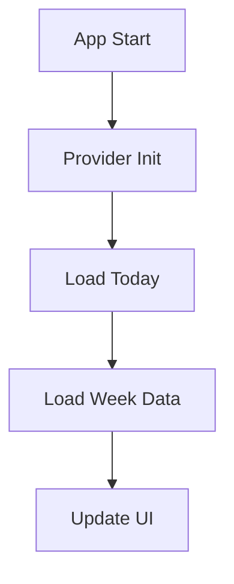
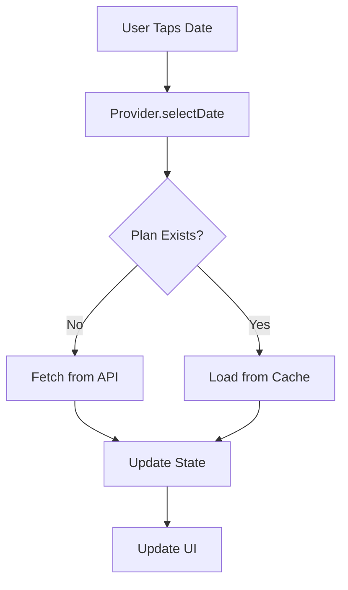
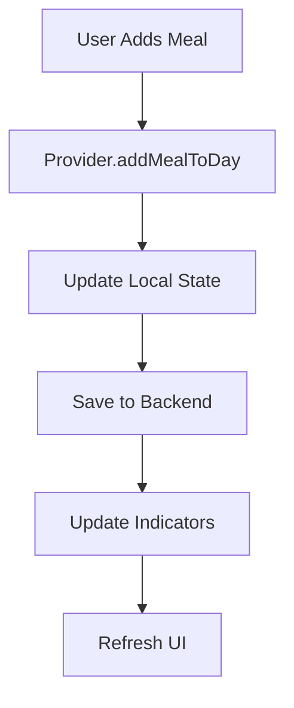

# 📱 Interfaz Unificada de Planificación de Comidas

## 🎯 **Visión General**

La **Interfaz Unificada de Planificación** combina la funcionalidad de planificación diaria y semanal en una sola experiencia de usuario intuitiva y moderna. Esta solución elimina la confusión entre múltiples interfaces y proporciona una experiencia fluida que se alinea perfectamente con el backend.

## ✨ **Características Principales**

### **🗓️ Vista Híbrida**
- **Vista Principal**: Enfoque diario detallado
- **Vista Secundaria**: Calendario semanal colapsable
- **Navegación Fluida**: Transiciones suaves entre días y semanas
- **Indicadores Inteligentes**: Puntos que muestran días con comidas planeadas

### **📱 Experiencia de Usuario Moderna**
- **Animaciones Fluidas**: Transiciones elegantes y responsivas
- **Diseño Intuitivo**: UI familiar y fácil de usar
- **Acciones Rápidas**: Barra de herramientas con accesos directos
- **Feedback Visual**: Estados de carga y confirmaciones

### **🔗 Integración Perfecta con Backend**
- **Estructura de Datos Nativa**: Alineada con endpoints existentes
- **Sincronización Automática**: Guarda cambios inmediatamente
- **Gestión de Estado Robusta**: Con Riverpod y manejo de errores
- **Performance Optimizada**: Carga lazy y caché inteligente

## 🏗️ **Arquitectura de Componentes**

```
📦 Unified Meal Planner
├── 🖥️ UnifiedMealPlannerScreen (Principal)
├── 📅 AnimatedWeekCalendar (Calendario)
├── 📋 DailyMealPlanView (Vista Diaria)
├── ⚡ QuickActionBar (Acciones Rápidas)
├── 🔄 UnifiedMealPlannerProvider (Estado)
└── 📊 MealPlanModel (Datos)
```

## 🚀 **Implementación**

### **1. Estructura de Archivos**

```
lib/features/planner/
├── presentation/
│   ├── screens/
│   │   └── unified_meal_planner_screen.dart     ✅ Creado
│   ├── widgets/
│   │   ├── animated_week_calendar.dart          ✅ Creado
│   │   ├── daily_meal_plan_view.dart           ✅ Creado
│   │   └── quick_action_bar.dart               ✅ Creado
│   └── providers/
│       └── unified_meal_planner_provider.dart  ✅ Creado
├── domain/
│   └── models/
│       └── meal_plan_model.dart                ✅ Creado
└── README_UNIFIED_PLANNER.md                   ✅ Este archivo
```

### **2. Dependencias Requeridas**

```yaml
dependencies:
  flutter_riverpod: ^2.4.9
  freezed_annotation: ^2.4.1
  json_annotation: ^4.8.1
  go_router: ^12.1.3

dev_dependencies:
  build_runner: ^2.4.7
  freezed: ^2.4.6
  json_serializable: ^6.7.1
```

### **3. Generación de Código**

```bash
# Generar archivos Freezed y JSON
flutter packages pub run build_runner build

# Para desarrollo continuo
flutter packages pub run build_runner watch
```

### **4. Integración en Routing**

```dart
// En tu archivo de rutas (app_router.dart)
GoRoute(
  path: '/planner',
  name: 'unified_planner',
  builder: (context, state) => const UnifiedMealPlannerScreen(),
),
```

### **5. Integración en Navegación Principal**

```dart
// En tu BottomNavigationBar
BottomNavigationBarItem(
  icon: Icon(Icons.calendar_today),
  label: 'Planificar',
  // Navega a /planner
),
```

## 🎮 **Guía de Uso**

### **🔧 Configuración Inicial**

1. **Importar el Provider**:
```dart
import '../features/planner/presentation/providers/unified_meal_planner_provider.dart';
```

2. **Usar en tu Widget**:
```dart
class MyApp extends ConsumerWidget {
  @override
  Widget build(BuildContext context, WidgetRef ref) {
    return MaterialApp.router(
      routerConfig: appRouter,
      // ... configuración
    );
  }
}
```

### **📱 Navegación de Usuario**

#### **Vista Principal - Día Seleccionado**
- **Swipe Izquierda/Derecha**: Navegar entre días
- **Tap en Fecha**: Expandir calendario semanal
- **Tap en Comida**: Ver/editar detalles
- **FAB**: Agregar nueva comida

#### **Vista Semanal - Calendario Expandido**
- **Tap en Día**: Seleccionar día específico
- **Flechas**: Navegar entre semanas
- **Puntos**: Indicadores de días con comidas

#### **Acciones Rápidas**
- **Agregar Comida**: Abrir selector de tipo de comida
- **Vista Semanal**: Toggle calendario expandido
- **Escanear**: Abrir cámara para reconocimiento
- **Generar**: Crear recetas con AI
- **Recetas**: Ver recetas guardadas
- **Inventario**: Acceder al inventario

### **⚙️ Personalización**

#### **Colores y Tema**
```dart
// En tu tema principal
ThemeData(
  colorScheme: ColorScheme.fromSeed(
    seedColor: Colors.green, // Color principal
  ),
);
```

#### **Configuración de Idioma**
Los textos están en español por defecto. Para personalizar:
```dart
// Modificar en cada widget según necesidades
const weekdays = ['L', 'M', 'M', 'J', 'V', 'S', 'D'];
const months = ['Ene', 'Feb', 'Mar', ...];
```

## 🔄 **Flujo de Datos**

### **1. Inicialización**


### **2. Selección de Fecha**


### **3. Agregar Comida**


## 🛠️ **API Integration**

### **Endpoints Utilizados**
```dart
// Lectura
GET /api/planning/get?date=2024-01-20
GET /api/planning/dates
GET /api/planning/all

// Escritura
POST /api/planning/save
PUT /api/planning/update
DELETE /api/planning/delete
```

### **Formato de Datos Backend**
```json
{
  "date": "2024-01-20",
  "meals": {
    "breakfast": [
      {
        "recipe_uid": "uuid",
        "servings": 2,
        "name": "Tostada Aguacate",
        "calories": 320
      }
    ],
    "lunch": [...],
    "dinner": [...],
    "snacks": [...]
  },
  "metadata": {
    "total_calories": 1850,
    "total_meals": 4
  }
}
```

## 🎯 **Mejores Prácticas**

### **🔄 Estado y Performance**
- **Carga Lazy**: Solo cargar datos cuando se necesiten
- **Caché Inteligente**: Mantener datos en memoria para navegación rápida
- **Debounce**: Evitar llamadas excesivas al API
- **Optimistic Updates**: Actualizar UI inmediatamente

### **🎨 UX/UI**
- **Feedback Visual**: Siempre mostrar estados de carga
- **Animaciones Sutiles**: Mejorar la percepción de fluidez
- **Accesibilidad**: Usar semantics y contraste adecuado
- **Responsive**: Adaptar a diferentes tamaños de pantalla

### **🔧 Mantenimiento**
- **Separación de Responsabilidades**: Widget, Provider, Modelo
- **Testing**: Unit tests para providers y modelos
- **Documentación**: Comentar funciones complejas
- **Error Handling**: Manejar todos los casos edge

## 📊 **Métricas y Analytics**

### **Eventos a Trackear**
```dart
// Ejemplos de eventos importantes
- meal_plan_day_viewed
- meal_added_to_plan
- week_calendar_expanded
- quick_action_used
- meal_plan_saved
```

### **KPIs de Éxito**
- **Engagement**: Tiempo en la pantalla de planificación
- **Conversión**: Comidas planeadas vs comidas cocinadas
- **Retención**: Usuarios que planifican semanalmente
- **Eficiencia**: Tiempo promedio para planificar

## 🚦 **Estados y Manejo de Errores**

### **Estados del Provider**
```dart
sealed class PlannerState {
  const PlannerState();
}

class Loading extends PlannerState {}
class Loaded extends PlannerState {}
class Error extends PlannerState {
  final String message;
}
```

### **Manejo de Errores**
- **Network Errors**: Mostrar botón de retry
- **Validation Errors**: Feedback inline
- **Server Errors**: Fallback a datos locales
- **Loading States**: Skeletons y spinners

## 🔮 **Futuras Mejoras**

### **Funcionalidades Planeadas**
- **🔄 Sincronización Offline**: PWA capabilities
- **🤖 Sugerencias AI**: Recomendaciones inteligentes
- **📊 Analytics Visuales**: Gráficos de nutrición
- **🔔 Notificaciones**: Recordatorios de comidas
- **📱 Widget de Home**: Vista rápida en inicio
- **🍽️ Modo Cocina**: Vista optimizada para cocinar

### **Optimizaciones Técnicas**
- **🎯 Performance**: Virtual scrolling para listas largas
- **💾 Storage**: IndexedDB para caché persistente
- **🔐 Security**: Encriptación de datos locales
- **🌐 I18n**: Soporte multi-idioma completo

## 💡 **Tips de Desarrollo**

### **Debugging**
```dart
// Habilitar logs detallados
final provider = ref.watch(unifiedMealPlannerProvider);
print('Provider state: ${provider.toString()}');
```

### **Testing**
```dart
// Ejemplo de test para provider
testWidgets('Should load meal plan for selected date', (tester) async {
  // Test implementation
});
```

### **Hot Reload**
- Los cambios en widgets se reflejan inmediatamente
- Los cambios en providers requieren restart
- Los cambios en modelos requieren code generation

---

## 🎉 **¡Felicidades!**

Has implementado exitosamente la **Interfaz Unificada de Planificación de Comidas**. Esta solución moderna y eficiente proporcionará a tus usuarios una experiencia excepcional para planificar sus comidas.

### **📞 Soporte**
- **Issues**: Reportar bugs en el sistema de tracking
- **Features**: Sugerir mejoras en roadmap
- **Documentation**: Actualizar este README según evolución

**¡Que disfrutes cocinando con tu nueva interfaz! 🍳✨**